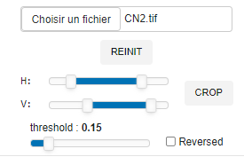
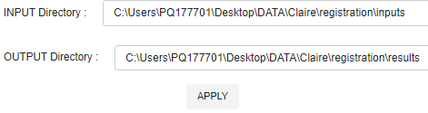

The registration is based on a `transformation matrix` calculated from 2 images: a ``moving`` image and a ``fixed`` image.

Once the 2 images have been loaded, the registration workflow that consists in images resizing and binarization as preliminary steps, is automatically performed (default mode).

The resulting `transformation matrix` can be applied to a set of images, assuming that these images are consistant with the one used previoulsy as 'moving image'.

# image parameters settings

The 2 images are loaded from the 2 dedicated boxes (**moving image** and **fixed image**) located at the top left of the window.

Once loaded, the images can be cropped via the 2 ranges sliders used to define the cropping rectangular area. 
The first slider is related to the **Horizonal** range selection (`H`), the second one to the **Vertical** range selection (`V`). 

Cropping is performed after clicking on the `CROP` button.

Note that for a sake of repetability only one cropping action is possible. To define a new cropping, the image has to be reinitialized with the `REINIT` button.

The `threshold` sliders are attached to the binarization processing. 
To make the binarized images compatible each other, the binarization step realizes automatic background detections. Nevertheless, in case of incorrect background determination, the user has the possibility to reverse each one of the binarized images thanks to the `Reversed` checkbox.

# images processing

The images processing consists in a `Resizing` step, a `Binarization` step and a `Registration` one.

The `Resizing` step consists in an image projection from the low to the high image resolution in the aim to work with identical image shapes and make the registration possible. There is no constraint about which one of the 2 images (moving or fixed) should be low or high resolution. 
Nonetheless, it is important to note that to preserve the same x-y scaling during the projection, a x or y 0-padding can be added to the low image resolution.

The `Binarization` step that relies on the threshold parameters defined above is an important step. For a correct registration, the pair of the binarized images should have the closest rendering/covering as possible in term of object representation.

The `Registration` step is performed according to the [pyStackreg](https://pystackreg.readthedocs.io/en/latest/readme.html) library, considering the "scaled rotation" transformation (translation + rotation + scaling).

Once the registration has been done in an automatic or iterative (step-by-step) mode, the user has the possibility to adjust manually the registration (translation and rotation). The center considered for the rotation is defined from the xc, yc relative coordinates associated to the resized images.

The resulting `transformation matrix` is displayed at any time in the bottom of the corresponding layout.

# images viewing

2 images view modes are available:

- `Difference` (default mode), used to highlight the differences between the 2 binarized/registered images

- `Overlay` which represents the fused (or averaged) image in gray colors

# images batch application

Once the registration has been done, the registration worflow (cropping + resizing + binarization + registration) can be applied similarly to a set of images defined in a `INPUT directory`. The resulting registred images are saved in the `OUTPUT directory` with the ``fixed`` image used as reference.

# Saving and reloading

All the workflow parameters and the transformation matrix can be saved and reloaded from  a `.json` file.

